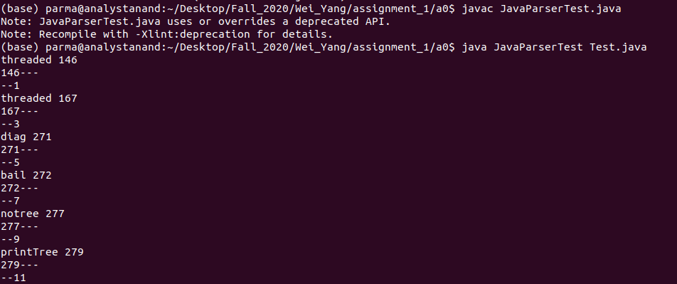
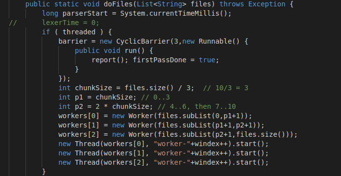
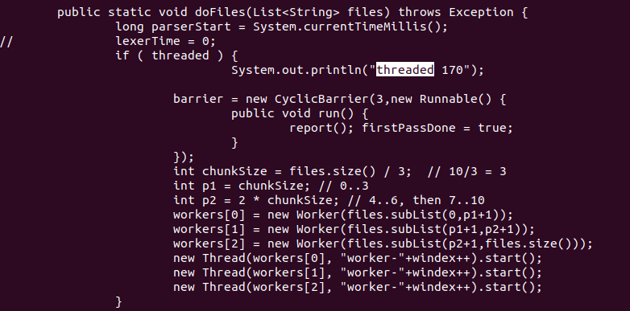

## Part 0: Getting Started
- set up ANTLR
- generated tree


## Part 1: Playing with Java Grammar and Parser
- created parser from Java8 grammer


## Part 2: Finding Interesting Program Facts through Parsing

 boolean variables with length > 3 and are only used without !
```
threaded 146
threaded 167
diag 271
bail 272
notree 277
printTree 279
```


## Part 3: Rewrite Program Source Code with Parser

Code Before Insertion



Code After Insertion
